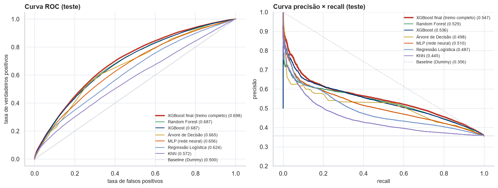
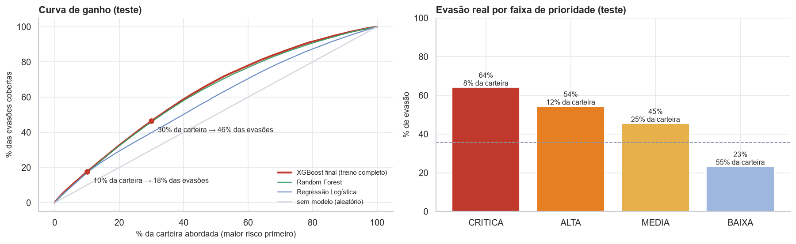

# PrevioPLS · Previsão de evasão pós-venda — documentação resumida

Challenge Ford · FIAP 2026 · Sprint 3 · Inteligência Artificial & Machine Learning
Desafio 02: *Impulsionando o VIN Share na América do Sul com Soluções Inteligentes*

| Integrante | RM |
|---|---|
| Giovanne Charelli Zaniboni Silva | 556223 |
| Gustavo Oliveira de Moura | 555827 |
| Lynn Bueno Rosa | 551102 |

O detalhamento completo, com código, tabelas e gráficos, está em `notebooks/previopls_evasao_sprint3.ipynb` (ou no `.html` ao lado). Este documento resume as decisões e os resultados.

---

## 1. Problema

O VIN Share mede quantos veículos Ford continuam fazendo manutenção na rede oficial. Quando o cliente troca a concessionária por uma oficina independente, raramente volta, e a rede só percebe depois que a revisão venceu.

**Objetivo:** no fechamento de cada ordem de serviço de revisão, estimar a probabilidade de o veículo **não voltar à rede para a próxima revisão no prazo**. Essa probabilidade alimenta a fila de leads do consultor no PrevioPLS.

**Tipo de problema:** classificação binária supervisionada.

- `evasao = 1`: nenhuma visita do mesmo VIN até o vencimento da próxima revisão + 90 dias;
- vencimento = 10 mil km ou 12 meses, o que vier primeiro, com o uso diário estimado pelo hodômetro;
- visitas cujo prazo ainda não venceu na data da extração (04/05/2026) ficam sem rótulo (censura) e são as que o modelo pontua em produção.

**Por que não o D0 puro do pitch original:** a planilha só traz veículos que já fizeram ao menos uma manutenção na rede, então quem comprou e nunca apareceu não está na base. A ablação (seção 4) mostra quanto as variáveis de venda explicam sozinhas: ROC-AUC 0,668.

## 2. Dados

`vin_share_Desafio_02.xlsx`, aba `vin_share`: 602.788 linhas, 25 colunas, 175.554 veículos, 435 concessionárias, serviços de 01/2020 a 05/2026, só Brasil. Cada linha é um item de uma manutenção concluída; a visita é o `MaintenanceID`. Não há dado pessoal (chassi em hash).

## 3. Preparação

| Etapa | O que foi feito |
|---|---|
| Diagnóstico | 10,4% de linhas duplicadas; 3 colunas constantes; 2 colunas 77% vazias; KM impossível, entrega antes da venda e OS fechada antes de abrir abaixo de 2% cada |
| Limpeza | duplicatas removidas; colunas constantes, esparsas e identificadores descartados; datas convertidas com formato fixo `mm/dd/aaaa`; revisões 52 e 99 removidas; agregação por visita; KM impossível anulado (fora de 100–500 mil, mais de 1.000 km/dia, hodômetro que volta); modelos raros em `OUTROS` |
| Outliers | valores fisicamente impossíveis viram faltante; outliers estatísticos reais (frota que roda muito, carro encomendado) ficam e passam por `log1p` |
| Alvo | 34,4% de evasão com tolerância de 90 dias (13 pontos de retorno atrasado + 21 de não retorno); sensibilidade testada com 30 e 180 dias |
| Features | 29 candidatas em 5 grupos (veículo, visita, plano de revisão, histórico do VIN, loja), num módulo único usado no treino e na inferência (`src/features_revisao.py`) |
| Anti-vazamento | teste automático que recalcula as features só com o passado em datas sorteadas e exige resultado idêntico |
| Divisão | temporal: treino com desfecho conhecido em 01/07/2024 (250 mil visitas), teste com as visitas a partir dessa data (122 mil); validação cruzada agrupada por VIN |
| Seleção | informação mútua (média de 5 repetições) contra variáveis de ruído + redundância (Spearman > 0,95): 21 features mantidas |
| Transformação | one-hot, *target encoding* da concessionária, mediana + indicador de faltante, `log1p` onde reduz a assimetria, padronização, tudo dentro de um `Pipeline` |

## 4. Modelos

Sete algoritmos, todos com o mesmo pré-processamento e a mesma validação: busca de hiperparâmetros numa amostra de 60 mil visitas do treino (sorteada por veículo), 5 folds agrupados por VIN, ROC-AUC como métrica de seleção. *Grid search* nos espaços pequenos e *random search* em Random Forest e XGBoost. O peso da classe minoritária entra como hiperparâmetro.

| Modelo | Por que entrou | Melhor configuração | ROC-AUC validação | Sobreajuste (treino − val) |
|---|---|---|---|---|
| **XGBoost** | referência em dados tabulares | profundidade 4, lr 0,03, 800 árvores, `min_child_weight` 20, L2 = 5 | **0,712** | 0,037 |
| Random Forest | bagging, reduz a variância da árvore | 200 árvores, profundidade 16, folha ≥ 5 | 0,709 | 0,156 |
| MLP | rede neural densa | 1 camada de 32, `alpha` 0,01, parada antecipada | 0,700 | 0,015 |
| Regressão Logística | linear e interpretável | `C` = 1, classes balanceadas | 0,700 | 0,007 |
| Árvore de Decisão | regras legíveis | profundidade 12, folha ≥ 200 | 0,692 | 0,026 |
| KNN | baseado em instâncias | 151 vizinhos, peso por distância | 0,679 | 0,321 |
| Baseline | referência mínima | proporção do treino | 0,500 | — |

**Ajuste fino do XGBoost:** taxa × número de árvores formam uma diagonal de configurações equivalentes; profundidade 3–4 é o melhor ponto (mais fundo sobreajusta); `scale_pos_weight` não muda a ROC-AUC, só desloca o limiar. Configuração final: lr 0,02, 1.000 árvores, profundidade 4.

**Ablação** (validação temporal dentro do treino): só os dados do veículo, conhecidos desde a venda, dão ROC-AUC 0,668. Somando visita, plano de revisão, histórico e loja, chega-se a 0,750. **Curva de aprendizado:** de 0,710 com 4 mil visitas para 0,750 com 161 mil. Por isso o modelo final treina nas 250 mil visitas do treino.

## 5. Avaliação e comparação

Teste temporal: 122.212 visitas a partir de 07/2024, 35,6% de evasão, nunca vistas em nenhuma etapa.

| Modelo | ROC-AUC | PR-AUC | Brier |
|---|---|---|---|
| **XGBoost final (treino completo)** | **0,698** | **0,547** | **0,209** |
| Random Forest | 0,688 | 0,529 | 0,211 |
| XGBoost (amostra de 60 mil) | 0,687 | 0,536 | 0,210 |
| Árvore de Decisão | 0,665 | 0,499 | 0,215 |
| MLP | 0,656 | 0,510 | 0,227 |
| Regressão Logística | 0,624 | 0,487 | 0,226 |
| KNN | 0,572 | 0,445 | 0,242 |
| Baseline | 0,500 | 0,356 | 0,230 |

Por que essas métricas: a **ROC-AUC** mede a qualidade da fila do consultor sem depender de limiar; a **PR-AUC** foca na classe de interesse (a referência é a taxa de evasão, 0,356); o **Brier** mede se a probabilidade mostrada no app é confiável; **F1, precisão e recall** avaliam a decisão de gerar o lead.

- **Limiar:** escolhido nas previsões fora da amostra do treino (0,295, máximo F1). No teste, o modelo **encontra 63% das evasões com 51% de precisão** (F1 0,565, contra 0,30 no limiar 0,5).
- **Ganho operacional:** abordar os 10% de maior risco cobre 18% das evasões; 30% da carteira cobre **46%**.
- **Faixas de prioridade** (cortes definidos no treino): crítica 64% de evasão real, alta 54%, média 45%, baixa 23%.
- **Estabilidade no tempo:** do CV para o teste, as árvores perderam 0,02–0,03 de ROC-AUC, a MLP 0,044, a Regressão Logística 0,076 e o KNN 0,107. Os modelos lineares e de distância extrapolam mal quando a frota envelhece além do que o treino viu.
- **Segmentos:** o desempenho cresce com o histórico (0,665 na 1ª revisão, ~0,72 da 4ª em diante), e nenhum modelo de veículo relevante fica abaixo de 0,62.
- **O que pesa na decisão** (permutação): dias desde a visita anterior domina, seguido de km acima do plano, modelo do veículo e prazo até a próxima revisão.

## 6. Conclusão

**Modelo selecionado: XGBoost.** Foi o melhor na validação e no teste, teve o menor sobreajuste entre os competitivos, foi o mais estável no tempo e o mais bem calibrado, e gera um artefato de 0,4 MB que pontua em milissegundos.

**Como entra no PrevioPLS.** Quando uma OS de revisão fecha, o core Spring Boot manda o histórico do VIN para o `ml-api` (FastAPI), que roda `src/inferencia.py`: as features saem da mesma função do treino, o pipeline exportado (`models/modelo_evasao.joblib`) devolve a probabilidade, e a resposta traz faixa de prioridade, perfil sugerido (Fiel, Econômico, Esquecido, Abandono) e data estimada da próxima revisão. Acima do limiar, o core cria o lead com o script comercial do perfil, e o app do consultor recebe push nos críticos. O notebook confirma, com um veículo real, que o score da inferência é idêntico ao do treino.

**Deploy proposto.** Container do `ml-api` no Render com o artefato carregado no boot; chamada online por OS fechada e job noturno que repontua a carteira aberta; monitoramento semanal de deriva das features (PSI) e mensal da ROC-AUC nas visitas cujo prazo venceu; retreino trimestral, com troca só se o modelo novo superar o atual no teste temporal; recalibração periódica das probabilidades, porque no teste o modelo subestima a evasão na faixa de 0,30 a 0,45.

**Na base de hoje** (04/05/2026), 81,5 mil veículos estão com a janela aberta, e 22 mil deles (27%) na faixa crítica, contra 8% no teste. A diferença vem da composição da carteira: a janela fica aberta mais tempo para quem roda pouco, que é o perfil de maior risco. A recomendação é distribuir os leads por faixa conforme a capacidade de cada loja, começando pelos críticos.

**Melhorias e trabalhos futuros**

- Cruzar com a base de vendas da Ford, para incluir quem nunca voltou e treinar o classificador no D0.
- Trazer valor da OS e desconto, para que o perfil Econômico vire alvo aprendido e o lead mostre a receita em risco.
- Medir a distância entre cliente e loja pelo CEP.
- Aplicar análise de sobrevivência para estimar o tempo até o retorno, tratando a censura em vez de descartá-la.
- Usar *uplift modeling* com o resultado das abordagens registradas no app.
- Montar MLOps com registro de versões e reavaliação automática.
- Trazer telemetria do veículo conectado, para ter km em tempo real.

